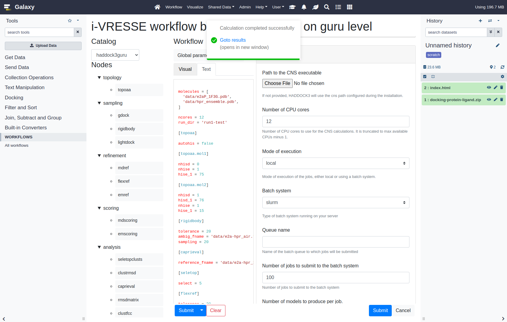

# Galaxy

https://galaxyproject.org/
Used from bioinformatics pipelines.

A workflow is constructed from previously executed tools. Each tool input can be exposed as workflow input.

- [Galaxy](#galaxy)
  - [Pros](#pros)
  - [Cons](#cons)
  - [Try](#try)
  - [Install galaxy](#install-galaxy)
  - [Example dataset](#example-dataset)
  - [Restrict users](#restrict-users)
  - [Custom user information](#custom-user-information)
  - [Combine workflow builder](#combine-workflow-builder)
    - [Embed](#embed)
      - [Webhook](#webhook)
    - [Visualization](#visualization)
    - [Alternate web page](#alternate-web-page)
    - [Wrap](#wrap)

## Pros

* Multi user
* Allows sharing data between users
* has runners https://docs.galaxyproject.org/en/master/lib/galaxy.jobs.runners.html like 
  https://pulsar.readthedocs.io/en/latest/readme.html
* has api https://bioblend.readthedocs.io/en/latest/api_docs/galaxy/docs.html , https://usegalaxy.org/api/docs , https://galaxyproject.org/develop/api/
* has dynamic rules to route jobs to runners

## Cons

* Clunky forms. Need to upload data in seperate step, before submitting tool
* by default compute on local or HPC batch queue systems with shared filesystem or use pulsar for non-shared fs
* can not see live stdout on running job, so hard to tell how far job has progressed
* the GUI is too restrictive, the input form for our jobs needs to be much more dynamic and custom
* vendor lock in is too great, I think we will customize is so much that is hard to keep up to date or switch

## Try

See `mine/` for config and tool.

Things to try

* [ ] upload archive file + unpack it + run haddock3
  * in single go
  * [x] upload as dataset first then run haddock3 with run dir as output
    * See mine/tools/docking/haddock3.xml 
  * as workflow, where unzip is done as workflow step
  * [x] upload as dataset first then run haddock3 with zip as output
    * See mine/tools/docking/haddock3zip.xml
  * [x] generate recipe in tool
    * See mine/tools/docking/haddock3files.xml
  * [x] HTML report, see https://planemo.readthedocs.io/en/latest/writing_advanced.html#single-html-output + https://stackoverflow.com/questions/65176053/printing-ls-la-in-html-file
    *  See mine/tools/docking/haddock3html.xml
* [x] haddock3 container image, see https://training.galaxyproject.org/training-material/topics/admin/tutorials/singularity/tutorial.html
  * See mine/tools/docking/haddock3.xml , mine/config/job_conf.xml
* [ ] job on
  * [x] local
  * [ ] slurm
  * [ ] remote with pulsar
  * [ ] grid
      * Integrating of dirac is open issue https://github.com/galaxyproject/galaxy/issues/14677
  * [ ] cloud
      * There is a [AWS Batch job runner](https://github.com/galaxyproject/galaxy/blob/a2465188067dbf370d7a947418e594e1cb9e5453/lib/galaxy/jobs/runners/aws.py#L87)
* [ ] rules to run tool on some job destination (if big then destination with shared fs), see https://training.galaxyproject.org/training-material/topics/admin/tutorials/job-destinations/tutorial.html
* [x] execute tool via api, see https://github.com/galaxyproject/bioblend
  * can we wrap bartender around galaxy?
  * See [client.py](client.py)
  * [ ] Wrapper web app which calls galaxy https://github.com/refinery-platform/refinery-platform
* [ ] only allow member of group to run haddock3,
  * see [#Restrict+users](#restrict-users) chapter
* [ ] orcid login, in /oidc_backends_config.xml.sample
* [ ] custom user fields, aka i am an academic or commercial fellow
   * see [#custom-user-information](#custom-user-information) chapter

Gotchas:
* Needed galaxy root in shorter path (/data/galaxy) as /home/someone/bla/something/somethingelse/ was too long
* static dir of custom visualization is not hosted, had to use symlink

## Install galaxy

```
export GALAXYMINE=$PWD/mine
cd ~  # Galaxy needs to be run in short path
git clone https://github.com/galaxyproject/galaxy.git
cd galaxy
git checkout v22.05
ln -s $GALAXYMINE/tools/docking tools/docking
ln -s  $GALAXYMINE/lib/galaxy/tool_util/toolbox/filters/restrict_academic.py lib/galaxy/tool_util/toolbox/filters/restrict_academic.py
cd config
for x in $(ls -1 $GALAXYMINE/config | grep -v plugins)
do
ln -s $GALAXYMINE/config/$x
done
ln -s $GALAXYMINE/config/plugins/webhooks/wbh3 config/plugins/webhooks/wbh3 
ln -s $GALAXYMINE/config/plugins/visualizations/haddock3 config/plugins/visualizations/haddock3
# Normally galaxy would copy static folder over during build, but does not happen so do manually
mkdir static/plugins/visualizations/haddock3
ln -s $GALAXYMINE/config/plugins/visualizations/haddock3/static static/plugins/visualizations/haddock3/static 
cd ..
python3 -m venv .venv
sh run.sh
```

See [mine/tools/docking/Dockerfile](mine/tools/docking/Dockerfile) how to make singularity container image for haddock3.

## Example dataset

```
cd <haddock3 repo>
cd examples/docking-protein-protein/
cp docking-protein-protein-test.cfg workflow.cfg
zip -r docking-protein-protein.zip .
```

1. Upload zip file
   1. Set type to `zip`
2. Launch haddock3 tool
   1. Select zip file 
   2. Set config file name = docking-protein-protein-test.cfg
  
After job complete each output file of haddock3 is an galaxy dataset (225 files).

## Restrict users

To only allow certain users to acces a tool 

In tool_filters in galaxy.xml and admin user management portal, see https://galaxyproject.org/user-defined-toolbox-filters/ 

1. Login as admin
2. Goto http://localhost:8080/admin/form/create_role
   * Name = ACADEMICS
   * Description = Role use to restrict tools to users that claim to be academic.
   * Create new group = Yes 
3. On http://localhost:8080/admin/users add you self to ACADEMICS group
4. TODO for some reason the function (./lib/galaxy/tool_util/toolbox/filters/restrict_academic.py) is not being executed

The function should hides the tool in the tool list, it does not make it un-executable, based on note in doc page.

## Custom user information

At http://localhost:8080/admin/form/create_form you can in theory create a form for user information.
The form should appear at http://localhost:8080/user/information for each user.

Some dead docs at https://galaxyproject.org/admin/config/user-information/

Throws error `TypeError: 'form_type' is an invalid keyword argument for FormDefinition`
when creating new form with file containing `Academic,Some help,text,somevalue,,True`.

## Combine workflow builder

https://github.com/i-VRESSE/workflow-builder

Want to use the workflow builder to make a config file or archive and then submit to galaxy

Ways to combine:

### Embed

Replace the file picker by the builder.

Problems:
* Galaxy does not allow custom form fields


#### Webhook

[webhook](https://docs.galaxyproject.org/en/latest/admin/special_topics/webhooks.html#tool-workflow).

The frontpage and several other places can have js+css injected into using webhooks. 

However a form for a tool is not one of them.

Created webhook that on click can open haddock3 tool form, but have not found way to wait for form to be opened completely.

### Visualization

Galaxy visualizations (`Visualize` in top nav bar) are single page web apps (SPAs) with a XML config file (`config/plugins/visualizations/<name>/config/<name>.xml`).
The workflow build is an SPA, so could be a galaxy visualization.

Installation:

1. Build dist in `workflow-builder/apps/haddock3-galaxy` aka https://github.com/i-VRESSE/workflow-builder/tree/galaxy-visualization/apps/haddock3-galaxy
2. Symlink `workflow-builder/apps/haddock3-galaxy/dist` to `config/plugins/visualizations/haddock3/static` and `static/plugins/visualizations/haddock3/static`

TODO 
* [x] fix loading css/js from index.html from correct base
* [x] talk to galaxy to 
  1. Create new history
  2. Upload zip
  3. Move zip to history
  5. Wait for move completion
  4. Execute tool
  5. Wait for tool completion
  6. Show results page link
* [x] load workflow which was uploaded to galaxy manually

Builder can be accessed from
* to load existing config 
  1. Goto http://localhost:8080/visualizations 
  2. Find haddock3 workflow builder
  3. Select zip file
* to start from scratch 
  1. Goto http://localhost:8080/static/plugins/visualizations/haddock3/static/ or click on leaf icon in navbar

Gotchas:
* to load `docking-protein-protein.zip` into workflow builder the expert or guru catalog should be selected.

Cons
* workflow builder assumes you are logged in
  * could check if logged in with `fetch('http://localhost:8080/api/whoami')` and responds is not `null`.
* visualization needs a dataset to visualize, so dataset could be a workflow archive to load in the builder, but can not start with nothing.
  * workaround is to go to /static URL, but will loose galaxy panels



### Alternate web page

Define route inside galaxy web application that hosts workflow builder.
Submission in workflow builder would
1. Create new history
2. Upload zip
3. Execute tool
4. Redirect 
   * to history page for tool to complete
   * to custom status page, on complete show html report

### Wrap

Builder submit button will submit to galaxy using api client.

Problems:
* share oidc token with builder and galaxy
* access to files in galaxy
